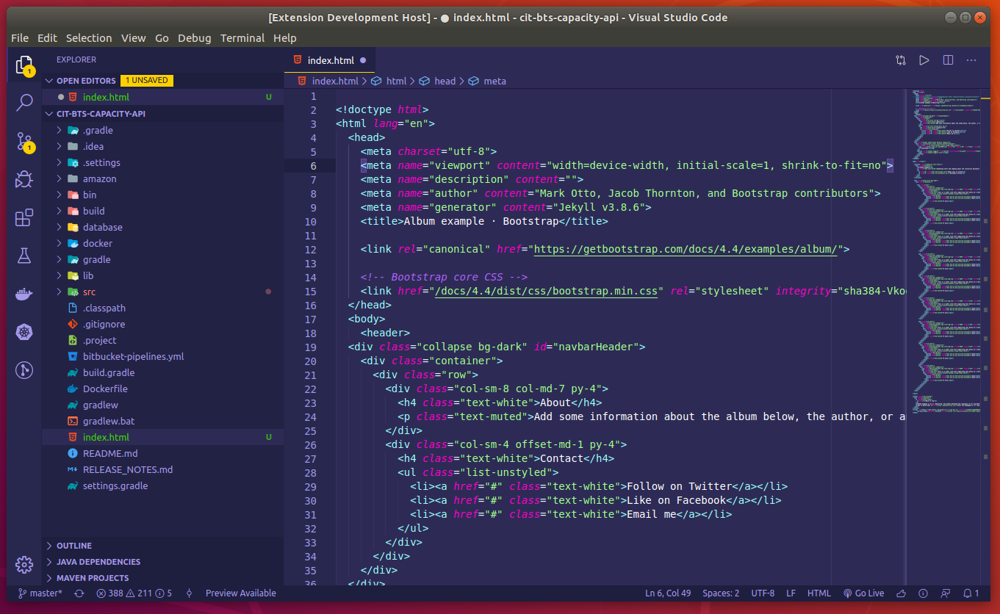

# Joker Smile Theme 🃏

This is a Visual Studio Code theme based on Joker's style.

 
  

## Easy Installation

1. Open the extensions sidebar on Visual Studio Code
2. Search for **Joker Smile**
3. Click **Install** to install it.
4. Click **Reload** to reload your editor.
5. Code/File ＞ Preferences ＞ Color Theme ＞ **Joker Smile**.
6. 🌟 [Rate five-stars](https://marketplace.visualstudio.com/items?itemName=marcosvidolin.joker-smile#review-details).

## Alternate Installation

1. Launch Quick Open using <kbd>Cmd</kbd>+<kbd>P</kbd> — or — <kbd>Ctrl</kbd>+<kbd>P</kbd>.
2. Paste the command `ext install marcosvidolin.joker-smile`
3. Click **Install** to install it.
4. Click **Reload** to reload the your editor.
5. Code/File ＞ Preferences ＞ Color Theme ＞ **Joker Smile**.
6. 🌟 [Rate five-stars](https://marketplace.visualstudio.com/items?itemName=marcosvidolin.joker-smile#review-details).

**Enjoy!**

## Thanks

I want to thank [@ahmadawais](https://github.com/ahmadawais) for build the [shades-of-purple-vscode](https://github.com/ahmadawais/shades-of-purple-vscode) theme on which I based and [@regivaldo](https://github.com/regivaldo) for all images and tips about style.

## Contributors

